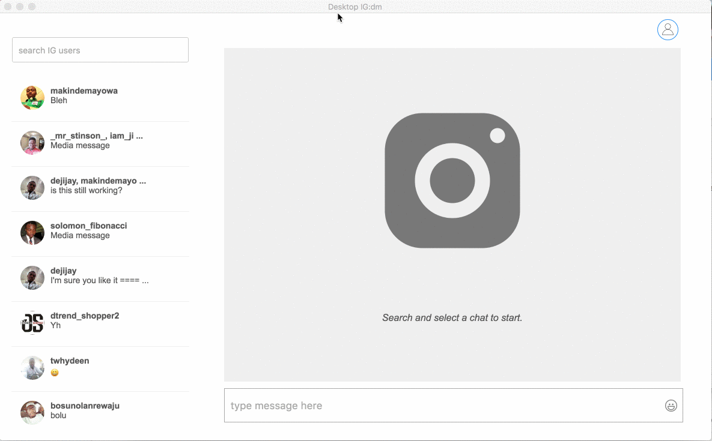
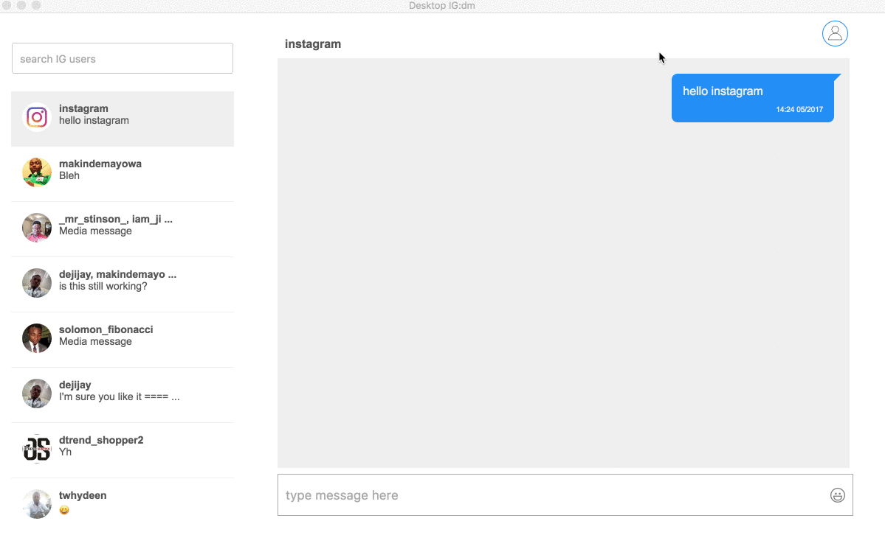
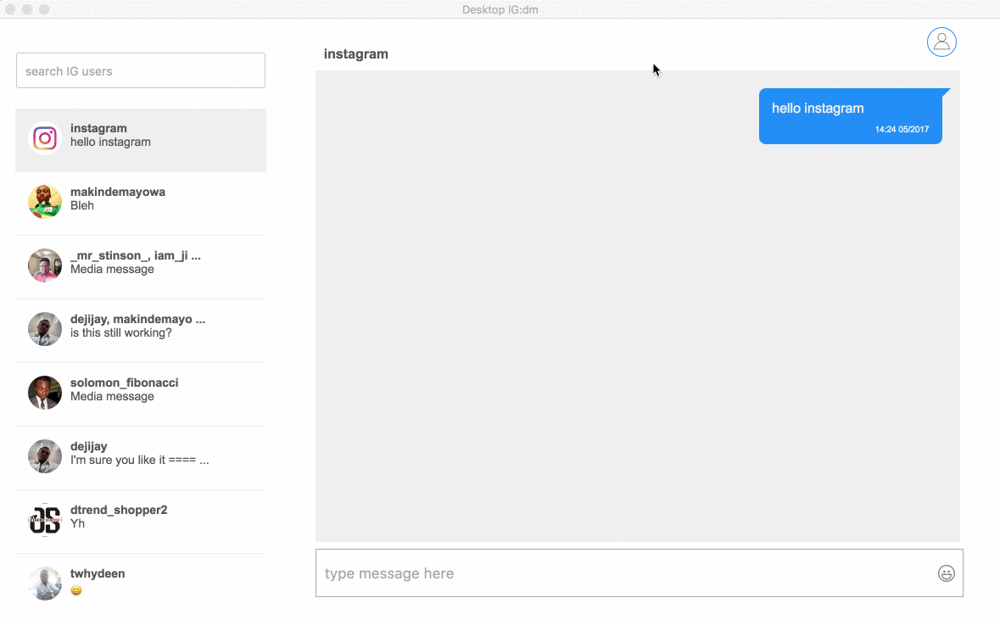

# IGdm Messenger
Multi-platform Desktop application for INSTAGRAM DMs, built with electron

### View Website
[here](https://igdm.me/)

### Preview

### Local Development

To setup this project locally for development purposes please follow the following steps:

1. Ensure you Node.js installed. [See](https://nodejs.org/en/download/)

2. Clone this repo by running the command - `git clone https://github.com/ifedapoolarewaju/igdm.git`

3. Navigate to the directory where the repo is cloned to. (e.g `cd igdm`)

4. Run `npm install` to install all the dependencies.

5. Start the application locally by running `npm start`

### New integration server

The repository now includes an Express API server for React, Flutter, and Laravel clients.

- Run `npm install` from the repo root.
- Start the API server with `npm run api:start`.
- The API listens on `http://localhost:4000`.

### React integration

Located in `react/`.

- `cd react`
- `npm install`
- `npm run dev`

This React app uses the API server at `http://localhost:4000`.

### Flutter integration

Located in `flutter/`.

- `cd flutter`
- `flutter pub get`
- If this is the first time running the sample, execute `flutter create .`
- `flutter run`

This Flutter client also targets `http://localhost:4000`.

### Laravel integration

A Laravel sample integration is included in `laravel/`.

- Copy `laravel/routes.php` into your Laravel app's route file.
- Copy `laravel/resources/views/igdm` into `resources/views/igdm`.
- Ensure `API_BASE_URL` points to `http://localhost:4000`.

### Notes

- The existing Electron app remains intact.
- The Express API reuses Instagram session and chat logic from the Electron backend.
- For production, apply secure session handling and HTTPS.

## License

[The MIT License](LICENSE).
